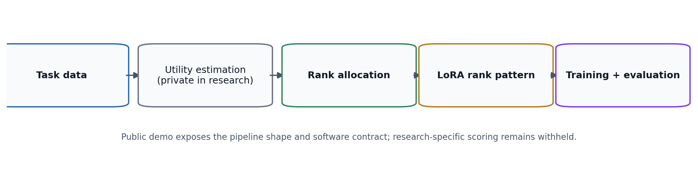

# Architecture

This document describes the public-safe architecture of the DULoRA demo. It is
not a disclosure of the private research algorithm.

## Public Pipeline



The repository separates the workflow into small modules:

| Stage | Public implementation | Notes |
| --- | --- | --- |
| Data | `dulora_demo.data` | Builds deterministic synthetic text-like tensors for offline checks. |
| Model | `dulora_demo.model` | Provides a tiny PyTorch classifier plus an optional PEFT model builder. |
| Allocation contract | `dulora_demo.allocator_interface` | Defines what a rank allocator returns without defining private policy logic. |
| Demo allocation | `dulora_demo.demo_allocator` | Uses deterministic round-robin assignment for public execution only. |
| Training | `dulora_demo.trainer` | Runs a compact PyTorch training loop. |
| Evaluation | `dulora_demo.evaluator` | Computes ordinary accuracy and binary F1. |
| Reproducibility | `dulora_demo.reproducibility` | Applies seed and deterministic runtime settings. |

## Boundary Design

The important design choice is that allocation is a contract:

```text
layer names + total rank budget -> rank pattern
```

The public demo can exercise that contract without exposing how the private
research implementation estimates utility or decides allocations. That means
external reviewers can inspect the code organization, tests, and integration
points while the unpublished research method remains protected.

## Why The Demo Allocator Is Simple

`RoundRobinDemoAllocator` is intentionally easy to audit. It:

- Deduplicates layer names while preserving order.
- Assigns each layer a minimum rank.
- Distributes remaining rank increments in round-robin order.
- Respects `min_rank`, `max_rank`, `rank_step`, and `total_budget`.
- Marks `is_research_algorithm` as `False`.

It does not inspect gradients, activations, losses, parameters, data-dependent
statistics, model internals, or private scoring signals.

## Optional PEFT Integration

`build_peft_sequence_classifier` shows how a supplied public rank pattern can
be passed into standard PEFT LoRA configuration. The function demonstrates an
integration point only; it does not compute or infer a research rank pattern.

## Generated Assets

The README figures are generated by:

```bash
python scripts/demo/generate_public_assets.py
```

Those assets are synthetic or conceptual and should not be treated as private
experiment traces.
