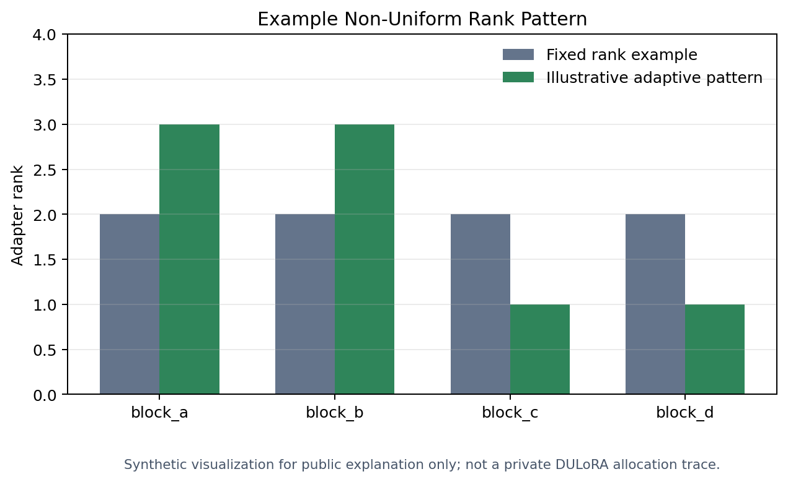

# Methodology Overview

This is a public-safe overview of the DULoRA software workflow. It explains the
shape of the method without disclosing unpublished research logic.

## Research motivation

LoRA reduces fine-tuning cost by training compact adapter matrices while the
pretrained model remains frozen. A common setup assigns the same adapter rank
to every selected module. DULoRA investigates whether a non-uniform allocation
can provide a useful alternative under a controlled adaptation budget.



## What this public demo demonstrates

The public project focuses on software boundaries rather than the unpublished
decision rule:

1. Prepare data and batches.
2. Build a PyTorch classifier or an optional Transformers/PEFT model.
3. Request a rank pattern through a stable allocator interface.
4. Train and evaluate the configured model.
5. Report ordinary classification metrics.

The included allocator uses deterministic round-robin assignment. It was
chosen because it is easy to inspect and clearly distinct from the research
implementation.

## Public implementation flow

```text
Synthetic/offline data
  -> Tiny PyTorch classifier
  -> Public allocator interface
  -> RoundRobinDemoAllocator
  -> Training loop
  -> Accuracy/F1 diagnostics
```

The private research implementation uses additional data-dependent estimation
and adaptive allocation components that are not part of this repository.

## What is intentionally absent

This distribution does not contain:

- A model-derived utility estimator.
- Research-specific scoring signals.
- The internal adaptive allocation policy.
- Internal experiment configurations.
- Layer-level observations or unpublished results.

These components are temporarily withheld while the associated academic work
is being prepared.

## Engineering value

Even with that boundary, the repository demonstrates:

- Modular Python package design.
- PyTorch data and training workflows.
- Hugging Face Transformers and PEFT integration.
- Configuration-driven execution.
- Testable interfaces and deterministic fixtures.
- Clear separation between research policy and execution infrastructure.

For module-level details, see [architecture.md](architecture.md). For results
interpretation, see [results.md](results.md).
