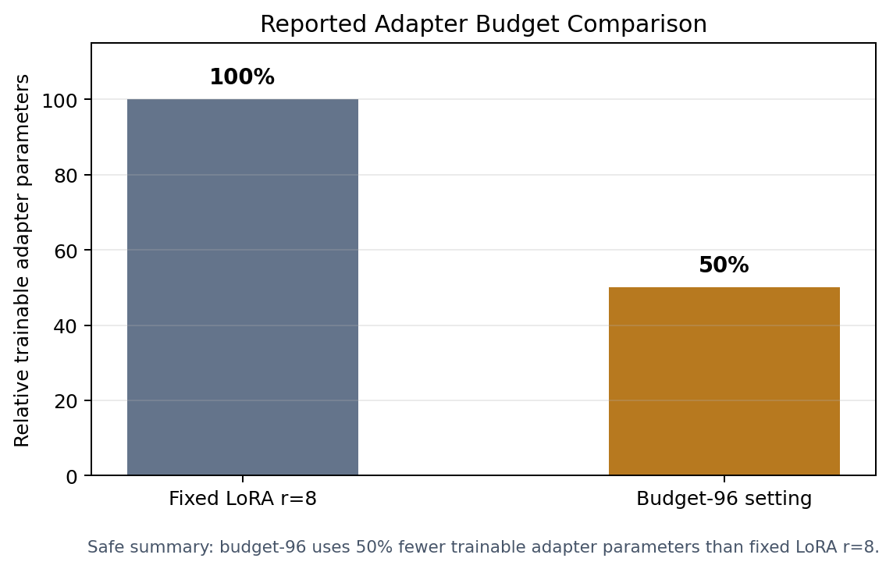

# Public Results Boundary

This repository reports only public-safe, high-level results context. It does
not include complete private experiment logs, unpublished allocation traces, or
research-specific implementation details.

## Safe Summary

| Topic | Public-safe statement |
| --- | --- |
| Text classification | The broader DULoRA project includes BERT-based text classification experiments. |
| Image classification | The broader DULoRA project includes ViT-based image classification experiments. |
| PEFT method | The work studies LoRA-style parameter-efficient fine-tuning with controlled adapter budgets. |
| Budget comparison | A reported budget-96 setting reduces trainable adapter parameters by 50% compared with fixed LoRA rank 8. |
| Accuracy interpretation | Accuracy trade-offs are preliminary and dataset-dependent. |
| Universal claims | This demo does not claim that DULoRA universally outperforms standard LoRA. |

## What The Demo Metrics Mean

`scripts/demo/run_demo.py` and `examples/minimal_text_classification.py` print
training loss, accuracy, and binary F1 from synthetic data. These values are
useful for software verification only:

- They confirm that the public package imports correctly.
- They check that synthetic data, model training, allocation, and evaluation
  can run end to end.
- They are not benchmark results.
- They should not be cited as DULoRA research performance.

## What Is Not Published Here

The public demo intentionally omits:

- The DULoRA utility estimator.
- Adaptive decision policy details.
- Internal experiment configurations.
- Private layer-level assignments.
- Complete benchmark tables.
- Full ablation studies.
- Unpublished thesis/manuscript figures.

## Interpreting The Budget-96 Statement

The budget-96 comparison is included because it is safe to state at a high
level: relative to a fixed LoRA rank-8 setup, the reported budget-96 setting
uses 50% fewer trainable adapter parameters.

This is a parameter-efficiency statement, not a blanket accuracy statement.
Whether a smaller adapter budget is preferable depends on the model, dataset,
metric, training protocol, and acceptable accuracy trade-off.

## Historical Artifacts

If older allocator outputs or historical plots appear outside this public demo
in the private/original project, they should be treated as internal development
artifacts unless explicitly documented as part of a public release. This demo
does not present historical allocator artifacts as latest research results.
